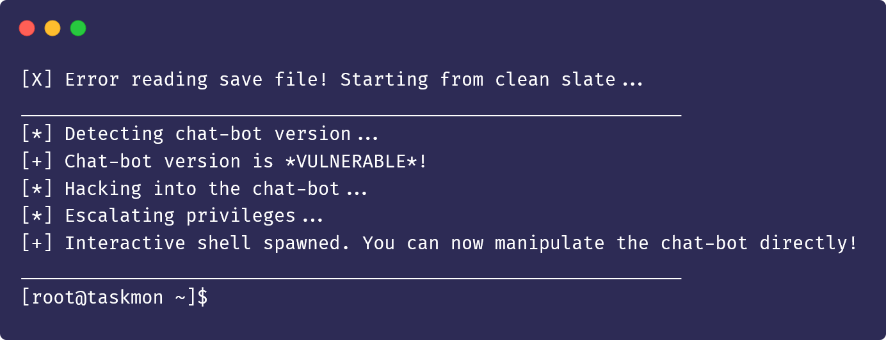
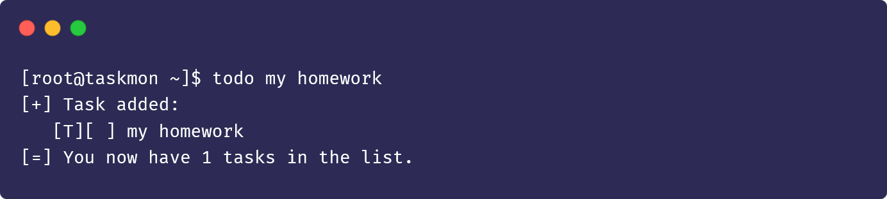
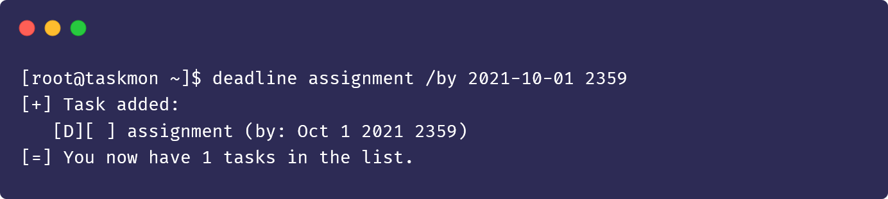
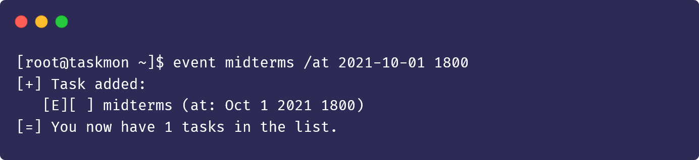
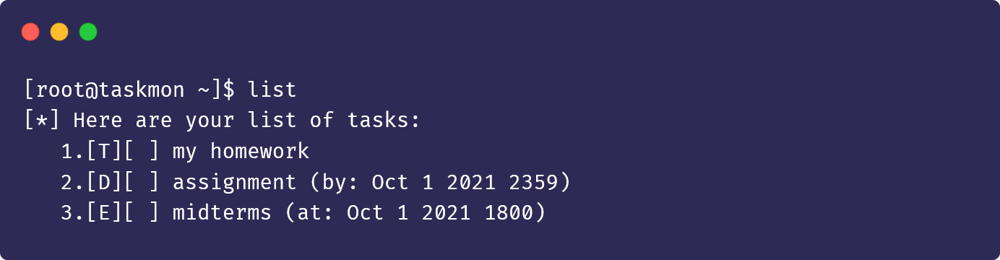
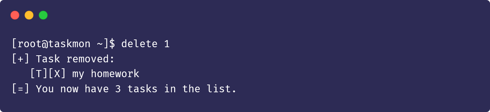
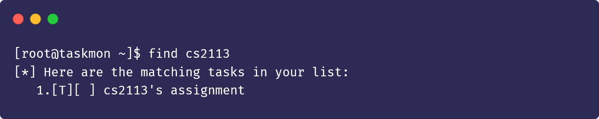
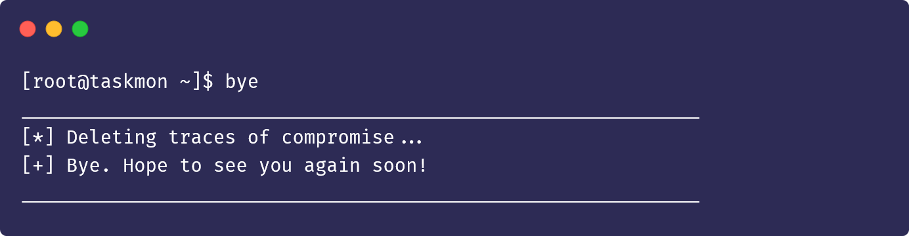

# User Guide

**Task Monitor** (**`taskmon`**) is a **Command Line Interface (CLI) app to assist in the management of your everyday tasks with a hacker-like feel**. If you are curious about hacking, and you type fast like a hacker, get ready to immerse yourself in the world of hacking as you compromise the `taskmon` chatbot and use it as your personal task manager!

* [Quick Start](#quick-start)
* [Features](#features)
  * [Add a task: `todo`, `deadline`, `event`](#add-a-task-todo-deadline-event)
  * [List all tasks: `list`](#list-all-tasks-list)
  * [Mark a task as completed: `done`](#mark-a-task-as-completed-done)
  * [Delete a task: `delete`](#delete-a-task-delete)
  * [Find tasks: `find`](#find-tasks-find)
  * [Exit the program: `bye`](#exit-the-program-bye)
  * [Save the data to a save file](#save-the-data-to-a-save-file)
  * [Edit the save file](#edit-the-save-file)
* [FAQ](#faq)
* [Command Summary](#command-summary)

## Quick start 

----

1. Ensure that you have `Java 11` or above installed on your machine.
2. Download the latest copy of `taskmon.jar` from [here](https://github.com/rizemon/ip/releases/latest).
3. Create or find a suitable directory and move `taskmon.jar` into it.
4. Open a command prompt by executing `cmd.exe` and navigate to the directory mentioned in the previous step.
5. Execute the command `java -jar  taskmon.jar` and you see something like this:


<!--```
[X] Error reading save file! Starting from clean slate...
____________________________________________________________
[*] Detecting chat-bot version...
[+] Chat-bot version is *VULNERABLE*!
[*] Hacking into the chat-bot...
[*] Escalating privileges...
[+] Interactive shell spawned. You can now manipulate the chat-bot directly!
____________________________________________________________
[root@taskmon ~]$
```-->

## Features 

---

### Add a task: `todo`, `deadline`, `event`

A task is injected into `taskmon`'s memory. Three different types of tasks are supported.

#### Add a Todo: `todo`

A Todo task contains only a task description.

Format: `todo <Task Description>`

Example usage and outcome:



<!--```
[root@taskmon ~]$ todo my homework
[+] Task added:
   [T][ ] my homework
[=] You now have 1 tasks in the list.
```-->

#### Add a Deadline: `deadline`

A Deadline task contains a task description and the timestamp that indicate when the task needs to be done by.

Format: `deadline <Task Description> /by <Timestamp>`

> 💡 `<Timestamp>` needs to be in the format of `yyyy-MM-dd <Time>` or `dd/MM/yyyy <Time>`. If no `<Time>` is supplied, it will be assumed to be `0000`.  

Example usage and outcome:



<!--```
[root@taskmon ~]$ deadline assignment /by 2021-10-01 2359
[+] Task added:
   [D][ ] assignment (by: Oct 1 2021 2359)
[=] You now have 1 tasks in the list.
```-->

#### Add an Event: `event`

A Event task contains a task description and the timestamp that indicate the time of occurrence of the task.

Format: `event <Task Description> /at <Timestamp>`

> 💡 `<Timestamp>` needs to be in the format of `yyyy-MM-dd <Time>` or `dd/MM/yyyy <Time>`. If no `<Time>` is supplied, it will be assumed to be `0000`.

Example usage and outcome:



<!--```
[root@taskmon ~]$ event midterms /at 2021-10-01 1800
[+] Task added:
   [E][ ] midterms (at: Oct 1 2021 1800)
[=] You now have 1 tasks in the list.
```-->

### List all tasks: `list`

Prints all the tasks currently in `taskmon`'s memory.

Format: `list`



<!--```
[root@taskmon ~]$ list
[*] Here are your list of tasks:
   1.[T][ ] my homework
   2.[D][ ] assignment (by: Oct 1 2021 2359)
   3.[E][ ] midterms (at: Oct 1 2021 1800)
```-->

### Mark a task as completed: `done`

Indicate a task as completed after you have finished it.

Format: `done <Task Index>`


<!--```
[root@taskmon ~]$ done 1
[+] Task marked as done:
   [T][X] my homework
```-->

### Delete a task: `delete`

Delete a task from `taskmon`'s memory.

Format: `delete <Task Index>`



<!--```
[root@taskmon ~]$ delete 1
[+] Task removed:
   [T][X] my homework
[=] You now have 3 tasks in the list.
```-->

### Find tasks: `find`

Prints all the tasks in `taskmon`'s memory whose descriptions contain the given keyword.

Format: `find <Keyword>`



<!--```
[root@taskmon ~]$ find cs2113
[*] Here are the matching tasks in your list:
   1.[T][ ] cs2113's assignment
```-->

### Exit the program: `bye`

Terminates the `taskmon` program.

Format: `bye`



<!--```
[root@taskmon ~]$ bye
____________________________________________________________
[*] Deleting traces of compromise...
[+] Bye. Hope to see you again soon!
____________________________________________________________
```-->

### Save the data to a save file

The tasks in `taskmon`'s memory are automatically saved to a save file `[JAR_LOCATION]/data/duke.txt` after the execution of every command.

### Edit the save file

Advanced users are able to update the tasks directly by editing the save file.

> ❗ Note that if the save file is detected to be corrupted or does not conform to `taskmon`'s save file format, it will still run without loading from it.

## FAQ

---

**Question**: What happens if there is no save file in the directory?  
**Answer**: `taskmon` will start from a clean slate and will automatically create one after running the first command.

**Question**: How can I share my save file to another computer?  
**Answer**:  Install `taskmon` on that computer and place the save file at `[JAR_LOCATION]/data/duke.txt` before running `taskmon`.

## Command Summary

---

| Action                      | Format                                                                                                                       | Example |
| --------------------------- | ---------------------------------------------------------------------------------------------------------------------------- | ------- |
| Add a task                  | `todo <Task Description>` <br><br> `deadline <Task Description> /by <Timestamp>` <br><br> `event <Task Description> /at <Timestamp>` | `todo my homework` <br><br> `deadline assignment /by 2021-10-01 2359` <br><br> `event midterms /at 2021-10-01 1800`  
| List all tasks              | `list` | `list`
| Mark task as <br> completed | `done <Task Index>` | `done 1` |
| Delete a task               | `delete <Task Index>` | `delete 1` |
| Find tasks                  | `find <Keyword> ` | `find cs2113t` |
| Exit the program            | `bye` | `bye` |

1. testing
    a. testing
2. testing
    b. testing
