# User Guide
Duke is a **desktop app for users to quickly manage their to-do list** via <a href="#CLI-Guide">Command Line Interface(CLI) </a> and <a href="#GUI-Guide">Graphical User Interface (GUI)</a>.

- <a href="#quick-start">Quick start</a>
- <a href="#CLI-Guide">Command Line Interface(CLI) Guide </a>
- <a href="#GUI-Guide">Graphical User Interface(GUI) Guide </a>
- <a href="#FAQ"> FAQ </a>

## Quick Start
1. Ensure `Java 11` are installed in your computer.
2. Download the latest `ip.jar` from here.
3. Copy the file to the folder you want to use as the home folder for Duke.
4. Type the following command in your terminal to run this program: java -jar ip.jar (You should change directory to where the ip.jar file is located or provide the absolute path of ip.jar).
5. Duke will ask for you to choose CLI mode or GUI mode.
6. Duke will ask for your name. If you are a new user, Duke will initialize an empty task list for you. If you have run Duke before, it will restore your saved tasks for you.
7. After Duke starts serving, type the command in the command box and press Enter to execute it (CLI mode), or press buttons to give corresponding commands (GUI mode).  

## Command Line Interface(CLI) Guide
- <a href="#features-cli"> Features </a>
- <a href="#summary-cli"> Command Summary </a>

### Features
1. <a href="#help-cli">Get help</a>
2. <a href="#add-task-cli">Add task</a>
3. <a href="#list-task-cli">List all tasks</a>
4. <a href="#complete-task-cli">Complete a task</a>
5. <a href="#find-task-cli">Find task(s)</a>
6. <a href="#sort-task-cli">Sort tasks</a>
7. <a href="#delete-task-cli">Delete task</a>
8. <a href="#exit-cli">Exit</a>

> Notes:
> - words in <> are required parameters from users
> - words in [] are optional parameters from users
  e.g. for `deadline <task description> /<YYYY-MM-DD> [HH:MM]`, \<task description\>, and \<YYYY-MM-DD\> are two required parameters, while \[HH:MM\] can be omitted. For example, `deadline cs2113 ip /2021-09-28` and `deadline cs2113 ip /2021-09-28 18:00` are both valid.

#### Get help
List all the commands format if users forget them
##### format: `help`
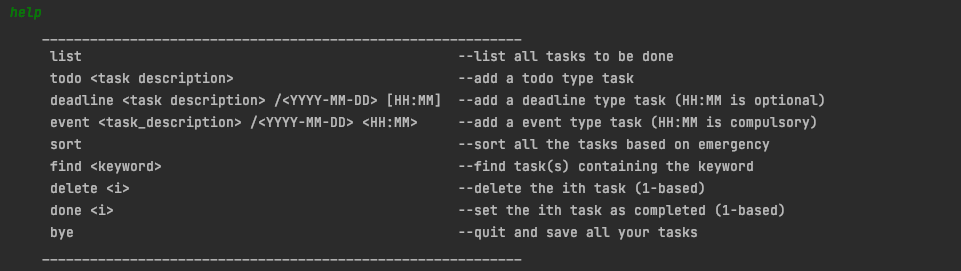

 

#### Add task
There are three possible task types that can be added.
* `todo`: A task without time constraint
* `deadline`: A task needs to be completed **before certain time**.
* `event`: A task needs to be complete **at certain time**.
##### format:
1. add a `todo` task: `todo <task description>`
###### example:
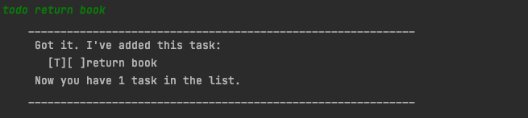 
2. add a `deadline` task: `deadline <task description> /<YYYY-MM-DD> [HH:MM]`
###### example:
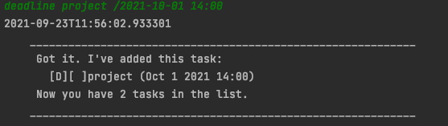  
3. add a `event` task: `event <task description> /<YYYY-MM-DD> \<HH:MM\>`
###### example: 
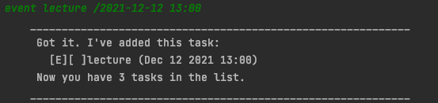

   

#### List all tasks
Show a list of all tasks.
##### format: `list`
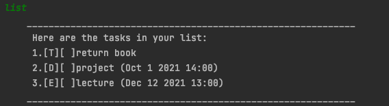

 

#### Complete a task
User can set a task at specific index after he/she has completed it.
##### format: `done <task index>`
- The index refers to the index number in the list.
- The index must be a positive number, and should not exceed the total number of tasks inside the list. Otherwise, Duke may throw a warning.
##### example:
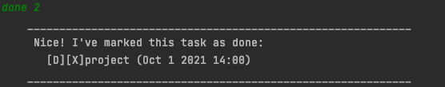

   

#### Find some task(s)
A user can search some task(s) containing certain keywords
##### format: `find <keyword>`
##### example:
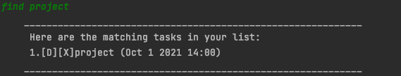

   

#### Sort tasks
Tasks can be sorted based on emergency. Tasks have closer deadline will be put in front.
##### format: `sort`
##### example:
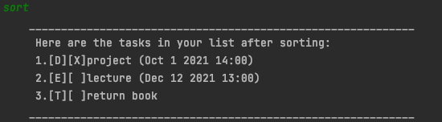

#### Delete tasks
delete a task at specific index.
##### format: `delete <task index>`
- The index refers to the index number in the list.
- The index must be a positive number, and should not exceed the total number of tasks inside the list. Otherwise, Duke may throw a warning.
##### example:
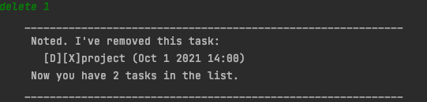

  
   

#### Exit
Exit the program and automatically save all the tasks.
##### format: `bye`
##### example:
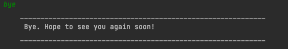

   

### Command Summary

Action | Command Format | Example
--- | --- | --- | 
Add a todo task | todo <task description>  | `todo return book`
Add a deadline task | deadline <task description> /<YYYY-MM-DD> \[HH:MM\] | `deadline cs2113 ip /2021-09-28 18:00`   `deadline cs2113 ip /2021-09-28`
Add an event task | event <task description> /<YYYY-MM-DD> \<HH:MM\> | `event cs2113 lecture /2021-10-01 14:00`
Delete a task | delete taskIndex | `delete 2`
Complete a task | done taskIndex | `done 1`
find a task | find <keyword> | `find cs2113`
List all tasks | list | `list`
Sort tasks | sort | `sort`
Get help | help | `help`
Exit | bye | `bye`

## Graphical User Interface(GUI) Guide

### Features
1. <a href="#add-task-gui">Add task</a>
2. <a href="#complete-task-gui">Complete a task</a>
3. <a href="#find-task-gui">Find task(s)</a>
4. <a href="#sort-task-gui">Sort tasks</a>
5. <a href="#delete-task-gui">Delete task</a>
6. <a href="#exit-gui">Exit</a>

#### Add task
There are three possible task types that can be added.
* `todo`: A task without time constraint
* `deadline`: A task needs to be completed **before certain time**.
* `event`: A task needs to be complete **at certain time**.
You can select the task type via the combobox, put the task name inside the textarea, and provide the time inside the textfield. After you click the "Add task" button, the task will appear inside the list on the right.

##### format:
1. add a `todo` task  
Task description is required, while the task time is not needed. Duke will ignore it even if you provide the time.

###### example:
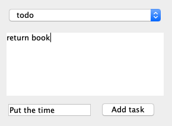 
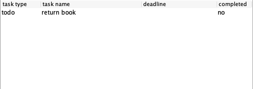 
2. add a `deadline` task  
Task description and deadline are required. Time should be in the format of `YYYY-MM-DD` or `YYYY-MM-DD HH:MM`. Otherwise, Duke may throw a warning.

###### example:
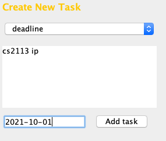  
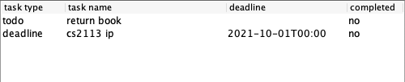  

3. add a `event` task  
Task description and time are required. Time should be in the format of `YYYY-MM-DD`. Otherwise, Duke may throw a warning.
###### example:
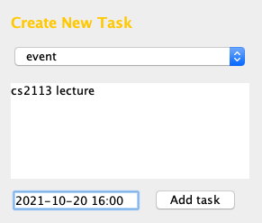  
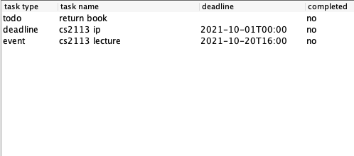  

### Complete a task
Select a task on the right list, and click the "finish task" button. It will be set as completed.

### Find a task
Put some keyword inside the textfield at the left of "find" button, and click the "find" button. Only tasks containing this keyword will appear in the list.

###  Sort tasks 
Tasks can be sorted based on emergency. Tasks have closer deadline will be put in front.

### Delete a task
Select a task on the right list, and click the "delete task" button. It will be deleted.

###  Exit 
Click the "exit" button to exit Duke.

## Edit the data file
Tasks data are saved as a `txt` file `[JAR File location]/UserStatus/[Username].txt`.  
Advanced users are welcome to update data directly by editing that data file.

> ❕**Caution**  
If your changes to the data file makes its format invalid, Duke will discard all data and start with an empty task list.

## FAQ
Q: Where is my task list data stored?  
A: There is a directory called `UserStatus` under where you store `ip.jar`. Your task list is named as `<your_username>.txt` and stored inside it.
