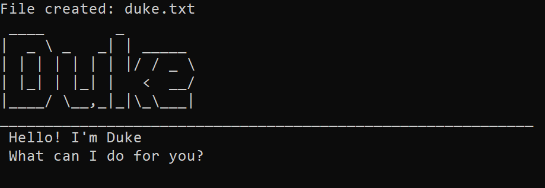

# Duke User Guide

Duke is a chatbot designed to keep track of all your tasks via a Command Line Interface (CLI). This user guide will help you get acquainted with the usage of this tool.

## Requirements

1. Ensure you have `Java 11`
2. Download the latest release of `ip.jar`

## Getting started

In the same directory as 'ip.jar', enter 'java -jar ip.jar' in a terminal to run Duke. If successful, Duke will appear as such on startup:

=======

## Commands

***Please follow the format of the given commands exactly to ensure correct operation of Duke.*** 

### Storing task

Duke supports 3 types of tasks: Todo, Event, Deadline. 

1. #### Todo

   A Todo is a simple task without a time constraint. It can be added using the command:

   General Format: `todo <description>` 

   For example,  `todo get a life`

2. #### Event

   An Event is a task that occurs at a specific time. It can be added using the command:

   General Format: `event <description> /at <time>` 

   For example,  `event lecture /at Tuesday 9 AM`

3. #### Deadline

   A Deadline is a task that must be completed by a specific time. It can be added using the command:

   General Format: `deadline <description> /by <time>` 

   For example,  `deadline assignment /by Tuesday 9 AM`

### Listing tasks

All tasks stored by Duke can be printed using the command `list`

### Marking tasks as done

Any task that is stored by Duke can be marked complete by calling the command:

General Format: `done <task number>` 

For example,  `done 1`

Please do not attempt to mark a task as done if it is not stored by Duke.

### Deleting task

Any task that is stored by Duke can be deleted by calling the command:

General Format: `delete <task number>` 

For example,  `delete 1`

Please do not attempt to delete a task if it is not stored by Duke.

### Searching for tasks

Given a query phrase, Duke can filter and print the stored tasks whose descriptions contain the query phrase. This can be achieved by calling the command:

General Format: `find <description>` 

For example,  `find life`

### Exiting the program 

Duke can be closed by entering the command: `bye`

*Any changes made to the stored tasks are written to file, retaining task progress even when Duke is closed. Pre-existing tasks are reloaded into Duke upon restarting the application.*
