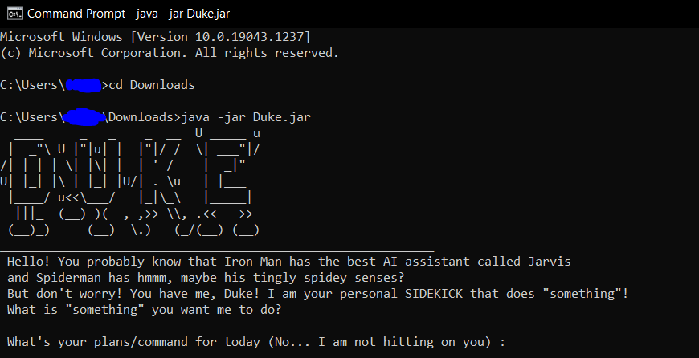

# Duke User Guide (UG)

Duke is a **Command Line Interface (CLI) app that helps you to better manage your tasks in life by being your personal assistant (PA).** If you have a preference for typing over clicking, then Duke would definitely be a great PA for you.

# Table of Contents
- [Quick Start](#quick-start)
- [Before continuing...](#before-continuing)
- [Features](#features)
  - [Adding a Task](#adding-task)
    - [Todo Task : `todo`](#todo-task)
    - [Deadline Task : `deadline`](#deadline-task)
    - [Event Task : `Event`](#event-task)
  - [List all tasks : `list`](#list-tasks)
  - [Mark task as done : `done`](#done-task)
  - [Delete task : `delete`](#delete-task)
  - [Find task : `find`](#find-task)
  - [Exit Duke Program : `bye`](#exit-duke)
- [Command Summary](#command-summary)

---

# Quick Start

1. Ensure you have Java version `11` or above installed on your computer.
    - If you haven't, you may download it from [here](https://www.oracle.com/java/technologies/downloads/#java11-linux).

> ❗ Please download them relative to your Operating System.

2. Next, download the latest `Duke.jar` from [here](https://github.com/Kair0s3/ip/releases).
    - Simply click on the `Duke.jar` under Assets and the download should start.
3. After downloading, open up `command prompt` .

> 💡 To open command prompt, `win` + `r` , then type and enter `cmd` .

4. Then, run the `Duke.jar` by typing in `java -jar Duke.jar`. Please make sure, that you are at the directory where `Duke.jar` is.
    - In the screenshot example below, I have kept `Duke.jar` in my Downloads folder.

5. Here on, you can type commands to tell Duke to do something for you. Below are some sample commands you can try out.
    - `list` : List all tasks that you have added.
    - `todo Do my iP User Guide` : Adds a Todo task to the list of tasks.
    - `done 2` : Marks the 2nd task in the list as done.
    - `delete 2` : Deletes the 2nd task in the list.
    - `find iP` : Finds any task in list with name containing "iP".
    - `bye` : Exits the app.
6. For more information on Duke's features, please refer to the [Features Section](#features).

---

# Before continuing...

Before continuing, here are some of the things you should take note of, to better understand the terminologies used in this UG.

| Terminologies | Definition |
|:-------------:|:----------:|
| Syntax | The right format to run the command. |
| `<taskName>` | <u><b>Required.</b></u> The name of the task. |
| `<atWhen>` | <u><b>Required.</b></u> The date and time of the Event. |
| `<byWhen>` | <u><b>Required.</b></u> The date and time of the Deadline. |
| `<index>` | <u><b>Required.</b></u> The index of the task as an integer (eg. 1, 2, 3) |
| `<keyword>` | <u><b>Required.</b></u> The word that you want to find. |

---

# Features

> ⚙ Please note that Duke is still a newborn, so there may be quite a number of bugs. However, if you find any bugs, you can let me know [here](https://github.com/Kair0s3/ip/issues).

## Adding a Task (3 types)

### Todo Task : `todo`

Adds a Todo task to the list of tasks.

Syntax - `todo <taskName>`

### Deadline Task : `deadline`

Adds a Deadline task to the list of tasks.

Syntax - `deadline <taskName> /by <byWhen>`

### Event Task : `event`

Adds an Event task to the list of tasks.

Syntax - `event <taskName> /at <atWhen>`

<u>Sample output of Adding an Event</u>

## List all tasks : `list`

Displays a list of tasks previously added. If no tasks exist , shows a message saying that the list of tasks is empty.

Syntax - `list`

<u>Sample output</u>

## Mark tasks as done : `done`

Marks a task as done given the index of the task in the list.

Syntax - `done <index>`

<u>Sample output</u>

## Delete task : `delete`

Deletes a task given the index of the task in the list.

Syntax - `delete <index>`

## Find task : `find`

Finds all tasks with task name containing a given keyword.

Syntax - `find <keyword>`

<u>Sample output</u>

## Exit program : `bye`

Exits the Duke program.

Syntax - `bye`

---

# Command Summary

| Action | Command | Example Usage |
|:------:|:-------:|:-------------:|
| Add Todo | `todo <taskName>` | `todo Do my iP User Guide` |
| Add Deadline | `deadline <taskName>` | `deadline iP Week 7 /by 2021-10-01` |
| Add Event | `event <taskName>` | `event CS2106 midterms /at 2-4pm This Wednesday` |
| List all task | `list` | `list` |
| Mark a task as done | `done <index>` | `done 3` |
| Delete a task | `delete <index>` | `delete 3` |
| Find a task | `find <keyword>` | `find iP` |
| Exit Duke program | `bye` | `bye` |