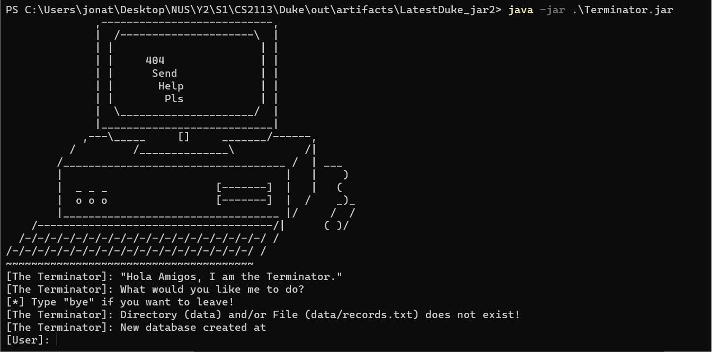
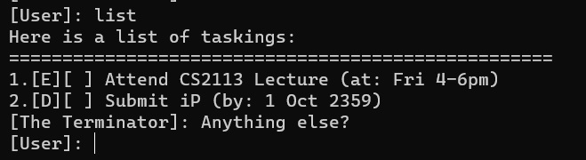
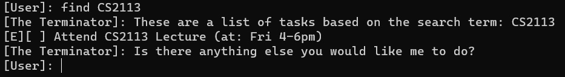
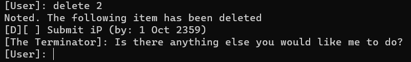
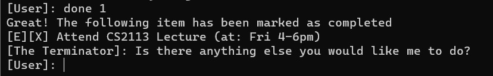
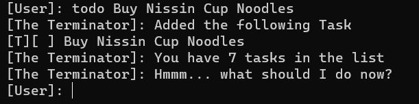
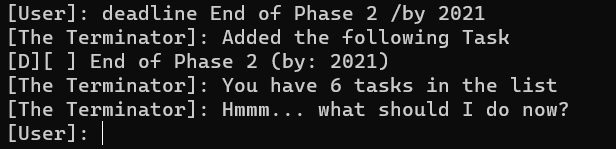
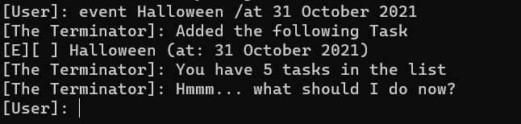
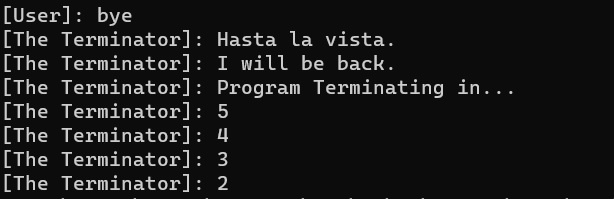

User Guide for Terminator
=============================
- [User Guide for Terminator](#user-guide-for-terminator)
- [Quick Start](#quick-start)
- [Features](#features)
  - [list](#list---lists-current-tasks)
  - [find](#find---filter-out-current-tasks-based-on-keywords)
  - [delete](#delete---delete-current-tasks-based-on-index-provided)
  - [done](#done---mark-current-tasks-as-completed-based-on-index-provided)
  - [todo](#todo---adds-a-new-todo-task-to-the-list)
  - [deadline](#deadline---adds-a-new-deadline-task-to-the-list)
  - [event](#event---adds-a-new-event-task-to-the-list)
  - [bye](#bye---exits-current-program)
  - [Saving Data](#saving-the-data)
  - [Editing Data](#editing-the-data-file)
-----------------------------

Terminator is a **command-line (CLI) desktop app for managing tasks to do.** It targets at fast typists 
who want to take a look at their tasks to do on the fly.

## Quick Start
1. Ensure you have Java `11` or above installed in your computer.


2. Download the latest version of Terminator from [here](https://github.com/wutdequack/ip/releases/tag/A-Release).


3. Copy the file to the folder you want to use as the home folder for Terminator.


4. Create a new folder called `data` and put your `records.txt` file there.


5. Open your favourite terminal/command shell with the context of your home folder and run the 
following command: ```java -jar Terminator.jar```.



6. Type in your command and press Enter to execute it. 
This is a list of sample commands you can try:

* `list`: Lists all tasks.
* `todo get the duck`: Adds an item `get the duck` in the todo list for a user to complete.
* `event Attend CS2113 Lecture /at Fri 4-6pm`: Adds an item `Attend CS2113 Lecture` at 
`Fri 4-6pm` in the event list for a user to attend.
* `deadline Submit iP /by 1 Oct 2359`: Adds an item `Submit iP` by
`1 Oct 2359` in the deadline list for a user to complete by the given time.
* `find CS2113`: Find all tasks that has the phrase `CS2113` in its title.
* `delete 3`: Deletes the 3rd task shown in the current list.
* `done 3`: Mark the 3rd task shown in the current list as _completed_.
* `bye`: Exits the program.

7. Refer to the [Features](#features) below for details of each command.

## Features 


### `list` - Lists current tasks

Lists all current tasks.

Format: ```list```
* If Current List is empty, no tasks will be listed. 

Example:
* ```list``` returns list of current tasks



### `find` - Filter out current tasks based on keywords

Filter tasks based on given keyword.

Format: ```find KEYWORDS```
* The search is sensitive. i.e CS2113 will be different from cs2113
* The search will look for all the keywords to see if it appears in the description of the task in 
that order.

Example:
* ```find CS2113``` returns `Attend CS2113 Lecture`




### `delete` - Delete current tasks based on index provided

Delete the specified task from the list. 

Format: ```delete INDEX```
* Deletes the task at the specified `INDEX`.
* The index refers to the index number shown in the displayed task list.
* The index must be a positive integer 1, 2, 3.

Example:
* ```delete 2``` will delete the second task `Submit iP` from the [list](ListCommand.jpg).





### `done` - Mark current tasks as completed based on index provided

Mark the specified task as Done in the list.

Format: ```done INDEX```
* Mark the task at the specified `INDEX` to be completed.
* The index refers to the index number shown in the displayed task list.
* The index must be a positive integer 1, 2, 3.

Example:
* ```done 1``` will mark the first task `Attend CS2113 Lecture` from the [list](ListCommand.jpg) 
as completed with a `X`.





### `todo` - Adds a new ToDo Task to the list

Adds a new ToDo task.

Format: ```todo TASKNAME```

Example:
* ```todo Buy Nissin Cup Noodles``` will add a ToDo Task with the name 
`Buy Nissin Cup Noodles` to the list. 




### `deadline` - Adds a new Deadline Task to the list

Adds a new Deadline task.

Format: ```deadline TASKNAME /by DATETIME```

Example:
* ```deadline End of Phase 2 /by 2021``` will add a Deadline Task with the name
  `End of Phase 2` with an attached timeframe `2021` to the list.




### `event` - Adds a new Event Task to the list

Adds a new Event task.

Format: ```event TASKNAME /at DATETIME```

Example:
* ```event Halloween /at 31 October 2021``` will add a Event Task with the name
  `Halloween` with an attached timeframe `31 October 2021` to the list.




### `bye` - Exits current program

Exits the program.

Format: ```bye```

Example:
* ```bye``` will quit this program



### Saving the data

Terminator data is _saved in the hard disk automatically_ after any command that changes the data. 
There is no need to save manually.

### Editing the data file
Terminator data are saved as a txt file at `data/records.txt` in relation to your local directory. 
Advanced users are welcome to update data directly by editing that data file.