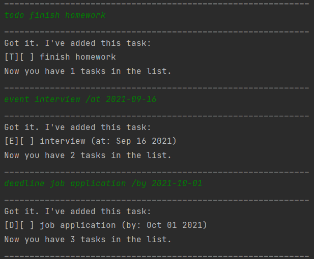
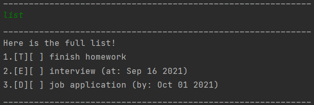
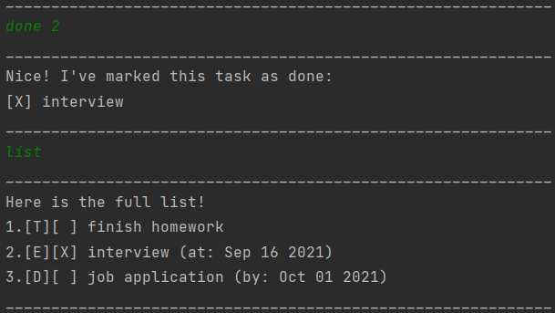
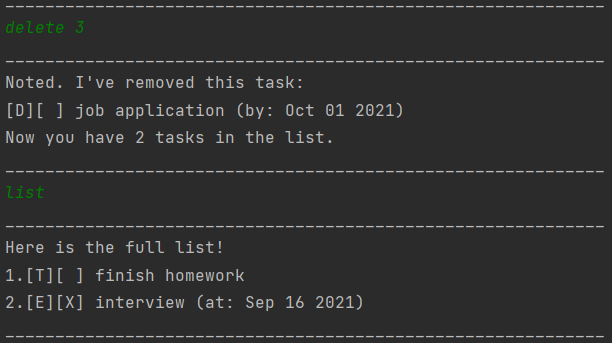
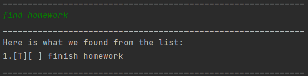
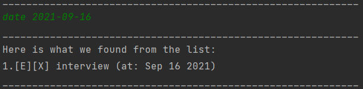
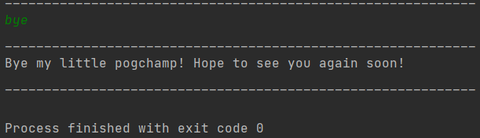

# About
Duke is a CLI (Command Line Interface) task manager that assists in managing your tasks.
This user guide will teach you how to use Duke.

# Quick Start
1. Download the latest Jar file
2. Go to the folder on your computer that contains the Jar file
3. Run the command `java -jar -IP.jar`

# Features 
### Summary
Below is a list of the features Duke offers:
1. [Adding tasks](#adding-tasks)
2. [List tasks](#list-tasks)
3. [Marking tasks as done](#marking-tasks-as-done)
4. [Deleting tasks](#deleting-tasks)
5. [Finding tasks by name](#finding-tasks-by-name)
6. [Finding tasks by date](#finding-tasks-by-date)
7. [Saving tasks](#saving-tasks)
8. [Exiting Duke](#exiting-duke)

### Adding tasks
There are 3 types of tasks you can add: todo,event,deadline.
* todo - tasks that you need to do; only requires task description
  * Format: `todo <task description>`
  * e.g `todo finish homework`
* event - tasks that you need to attend; need event description and date of event in 
format `/at yyyy-mm-dd`
  * Format: `event <event description> /at <yyyy-mm-dd/>` 
  * e.g `event interview /at 2021-09-16`
* deadline - tasks that you need to finish at a certain date; need deadline 
description and date of deadline in format `/by yyyy-mm-dd`
  * Format: `deadline <deadline description> /by <yyyy-mm-dd>`
  * e.g `deadline job application /by 2021-10-01`
  


### List Tasks
You can list all the tasks you have stored.
* e.g `list`



### Marking tasks as done
You can mark a task as done by providing the `done` command
and providing the index of the task you want to mark as done.
* Format: `done <task index>`
* e.g `done 2`



### Deleting tasks
You can choose to delete a task by providing the `delete` command
and providing the index of the task you want to delete.
* Format: `delete <task index>`
* e.g `delete 3`



### Finding tasks by name
You can search the task you want by its name. This can be done
by providing the `find` command and providing the search keyword.
* Format: `find <keyword>`
* e.g `find homework`



### Finding tasks by date
You can search the task you want by its date. This can be done by 
providing the `date` command and providing the date you want to search
by using the format `yyyy-mm-dd`.
* Format: `date <yyyy-mm-dd>`
* e.g `date 2019-09-16`



### Saving tasks
Duke will save for you your tasks everytime a task is added, deleted 
or mark as done. It will also save everytime you exit the program so
that when you next enter, your saved tasks will still be there. The 
tasks are stored in 'duke.txt', in the same folder as your JAR file.

### Exiting Duke
You can exit the program by providing the `bye` command.
* e.g `bye`




```
