# User Guide
Karen is a **Command Line Interface (CLI) Chat Bot for managing your tasks.**, inspired by the TV show _SpongeBob
SquarePants_.

- [Features](#features)
  - [Adding a To Do task: `todo`](#todo)
  - [Adding an Event task: `event`](#event)
  - [Adding a Deadline task: `deadline`](#deadline)
  - [Listing all tasks: `list`](#list)
  - [Marking a task as done: `done`](#done)
  - [Deleting a task: `delete`](#delete)
  - [Searching for tasks: `find`](#find)
  - [Showing the tasks on a specific day: `show`](#show)
  - [Exiting the program: `bye`](#exit)
  - [Saving the data](#save)
- [Command summary](#summary)

--------------------------------------------------------------------------------------------------------------------

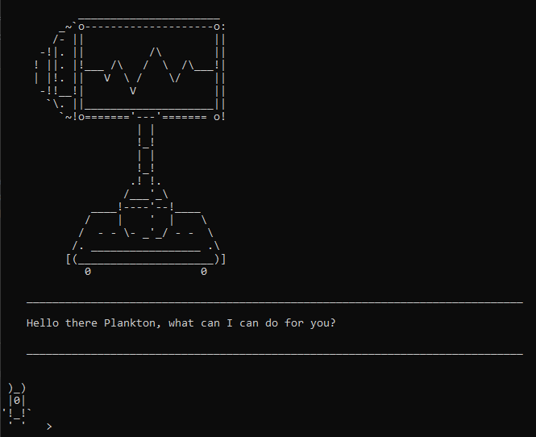

--------------------------------------------------------------------------------------------------------------------

## Features

###  Adding a To Do task: `todo`

Adds a To Do task to the task list.

#####Format: `todo [TASK_DESCRIPTION]`

:warning: `[TASK_DESCRIPTION]` cannot be empty.

#####Example:

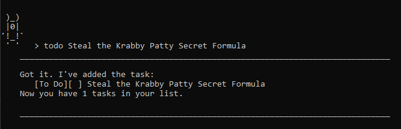

 

###  Adding an Event task: `event`

Adds an Event task to the task list.

#####Format: `event [TASK_DESCRIPTION] \at [TASK_DATE] {TASK_TIME}`

:warning: `[TASK_DESCRIPTION]` cannot be empty.

:warning: `[TASK_DATE]` cannot be empty but `TASK_TIME` is optional.

:warning: `[TASK_DATE]` must be in the format `DD-MM-YYYY`.

:warning: `[TASK_TIME]` if not empty must be in the format `hhmm`.

#####Example:
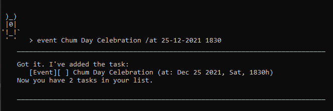

 

###   Adding a Deadline task: `deadline`

Adds a Deadline task to the task list.

#####Format: `deadline [TASK_DESCRIPTION] \by [TASK_DATE] {TASK_TIME}`

:warning: `[TASK_DESCRIPTION]` cannot be empty.

:warning: `[TASK_DATE]` cannot be empty but `TASK_TIME` is optional.

:warning: `[TASK_DATE]` must be in the format `DD-MM-YYYY`.

:warning: `[TASK_TIME]` if not empty must be in the format `hhmm`.

#####Example:
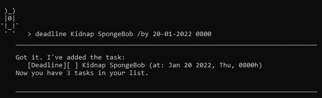

 

###  Listing all tasks: `list`
Prints out all current tasks stored in the task list.

#####Format: `list`

######Examples:

* If the task list is empty:

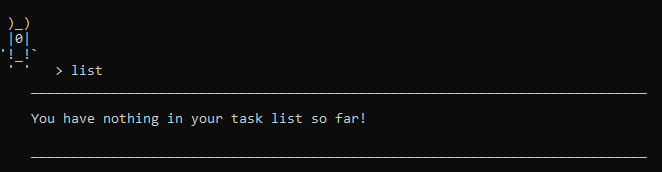

* If the task list is not empty:

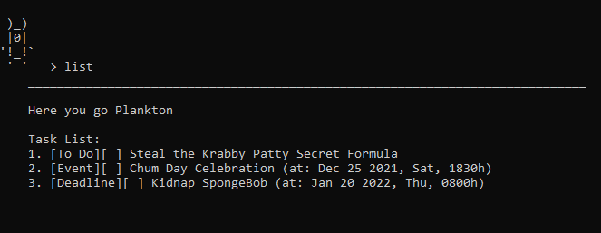

 

###  Marking a task as done: `done`
Marks a task as completed in the task list using the given task's index.

#####Format: `done [TASK_INDEX]`

:warning: `[TASK_INDEX]` must be an integer between 1 and the size of the task list inclusive.

#####Example:

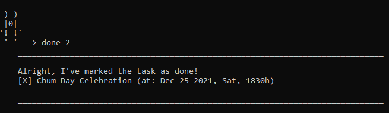

 

###  Deleting a task: `delete`
Removes a task from the task list using the given task's index.

#####Format: `delete [TASK_INDEX]`

:warning: `[TASK_INDEX]` must be an integer between 1 and the size of the task list inclusive.

#####Example:

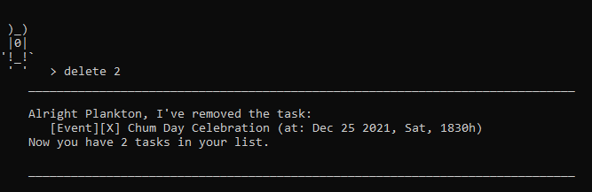

 

###  Searching for tasks: `find`
Prints out all the tasks whose description matches the given keyword.

#####Format: `find [KEYWORD]`

:warning: `[KEYWORD]` must not be empty.

#####Example:

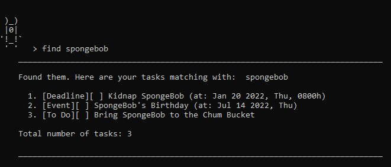

 

###  Showing the tasks on a specific day: `show`
Prints out all the tasks that occurs on the given task date.

#####Format: `show [TASK_DATE]`

:warning: `[TASK_DATE]` must not be empty.

:warning: `[TASK_DATE]` must be in the format `DD-MM-YYYY`.

#####Example:

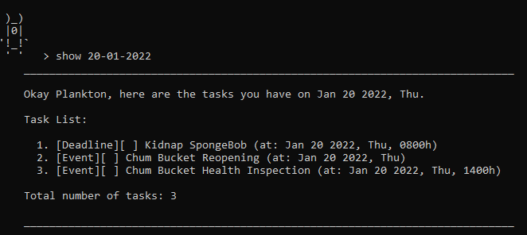

 

###  Exiting the program: `bye`
The program stops running and exits.

#####Format: `bye`

#####Example:

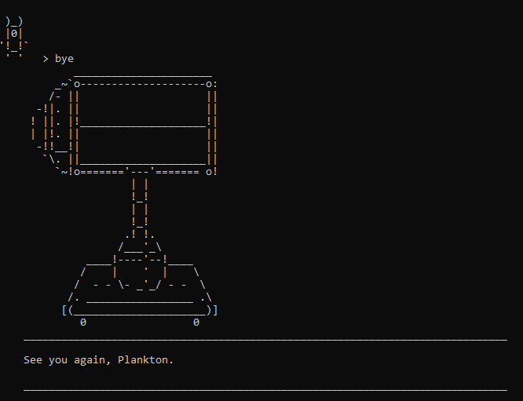

 

###  Saving the data
- Karen's data in the task list is saved in the user's local data storage automatically after any command that changes the data.

- If Karen is running for the first time and there is no saved file in the local data
  storage, a new file will be created during the first run automatically.

--------------------------------------------------------------------------------------------------------------------

## Command Summary

Action | Format | Examples
--------|------------|---------
Add To Do task | `todo [TODO_DESCRIPTION]` | `todo Steal the Krabby Patty Secret Formula`
Add Event task | `event [TASK_DESCRIPTION] /at [TASK_DATE] {TASK_TIME}`| `event Chum Day Celebration /at 25-12-2021`   `event Chum Day Celebration /at 25-12-2021 1830`
Add Deadline task | `deadline [TASK_DESCRIPTION] /by [TASK_DATE] {TASK_TIME}`| `deadline Kidnap SpongeBob /by 20-01-2022`   `deadline Kidnap SpongeBob /by 20-01-2022 0800`
List all tasks| `list` | `list`
Done task | `done [TASK_INDEX]`|`done 2`
Delete task | `delete [TASK_INDEX]`| `delete 2`
Find tasks | `find [KEYWORD]`| `find spongebob`
Show tasks | `show [TASK_DATE]` | `show 21-01-2022`
Exit program | `bye` | `bye`

--------------------------------------------------------------------------------------------------------------------

