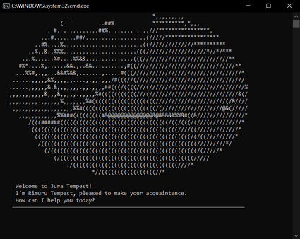
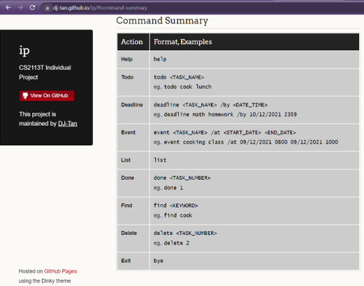

# User Guide

Duke is a **Personal Assistant ChatBot** desktop app that helps a person to **keep track of various activities**, optimised 
for use via a Command Line Interface (CLI). If you can type fast, Duke is capable of tracking and updating management 
tasks faster than Graphical User Interface (GUI) apps.

- [Set Up](#set-up)
- [Quick Start](#quick-start)
- [Features](#features)
  - [Viewing Help](#viewing-help)
  - [Adding a Todo Task](#adding-a-todo-task)
  - [Adding a Deadline Task](#adding-a-deadline-task)
  - [Adding a Todo Task](#adding-an-event-task)
  - [Listing all Tasks](#listing-all-tasks)
  - [Mark as Done](#mark-as-done)
  - [Find Tasks](#find-tasks)
  - [Delete a Task](#delete-a-task)
  - [Exiting the Program](#exiting-the-program)
- [FAQ](#faq)
- [Command Summary](#command-summary)

## Set Up

1. Ensure that you have [Java 11](https://docs.aws.amazon.com/corretto/latest/corretto-11-ug/downloads-list.html) or 
above installed in your Computer.
2. Download the latest `ip.jar` file from [here](https://github.com/DJ-Tan/ip/releases/tag/A-UserGuide).
3. Copy the file to the folder you want to use as the _home folder_ for your ChatBot.
4. For **Windows users**:
   1. Open a `notepad.exe`
   2. Write the following line of code
      ```console
      java -jar ip.jar
      ```
   3. Save the file as `run.bat`
   4. Copy it to the directory which contains the `ip.jar` file
   5. Double-click `run.bat` to run the `ip.jar`
5. For **Mac/Linux users**:
   1. Create a new `.txt` file
   2. Write the following line of code
      ```shell
      #!/bin/sh
      
      java -jar ip.jar
      ```
   3. Save the file as `run.sh`
   4. Copy it to the directory which contains the `ip.jar` file
   5. Double-click `run.bat` and select _Run in the terminal_ to run the `ip.jar`


## Quick Start

1. On startup, a terminal similar to below should appear in a few seconds.\
   
2. Type a command and press Enter to execute it.\
   Some example commands you can try:
   - **`help`** : Lists all commands
   - **`list`** : Lists all tasks.
   - **`todo`** `read book` : Adds a todo task called `read book` into the task list
   - **`delete`** `1` : Deletes the first task in a list
   - **`exit`** : Exits the app.
3. Refer to the [Features](#features) below for details of each command.


## Features 

### Viewing Help

Opens a web browser of the User Guide.

Format: `help`

Example of usage:
```console
help
```

Expected outcome:
```console
NOTICE: Github page opened in browser...
```


### Adding a Todo Task

Adds a task without any date/time attached to it _e.g., visit new theme park_

Format: `todo <TASK_NAME>`

Example of usage:
```console
todo borrow book
```

Expected outcome:
```console
NOTICE: I've added this task...
    [T][ ] borrow book
Now you have 1 task(s) in the list.
```

### Adding a Deadline Task

Adds a task that need to be done before a specific date/time _e.g., submit report by 11/10/2019 1700_

Format: `deadline <TASK_NAME> /by <DATE_TIME>`

- The `/by` tag has to be placed between `TASK_NAME` and `DATE_TIME`
- `DATE_TIME` follows the format of `dd/MM/yyyy HHmm`
- `DATE_TIME` must be after the current date

Example of usage:
```console
deadline return book /by 19/09/2021 2100
```

Expected outcome:
```console
NOTICE: I've added this task...
    [D][ ] return book (by: 19/09/2021 2100)
Now you have 2 task(s) in the list.
```

### Adding an Event Task

Adds a task that start at a specific time and ends at a specific time e.g., team project meeting on 2/10/2019 2-4pm

Format: `event <TASK_NAME> /at <START_DATE> <END_DATE>`

- The `/at` tag has to be placed between `TASK_NAME` and `START_DATE`
- `START_DATE` and `END_DATE` follows the format of `dd/MM/yyyy HHmm`
- `START_DATE` and `END_DATE` must be after the current date
- `START_DATE` has to be before `END_DATE`

Example of usage:
```console
event project meeting /at 21/09/2021 1400 to 21/09/2021 1600
```

Expected outcome:
```console
NOTICE: I've added this task...
    [E][ ] project meeting (at: 21/09/2021 1400 to 21/09/2021 1600)
Now you have 3 task(s) in the list.
```

### Listing all Tasks

Shows a list of all tasks.

Format: `list`

Example of usage:
```console
list
```

Expected outcome:
```console
NOTICE: Here are the task(s) in your list...
    1.[T][ ] borrow book
    2.[D][ ] return book (by: 19/09/2021 2100)
    3.[E][ ] project meeting (at: 21/09/2021 1400 to 21/09/2021 1600)
```

### Mark as Done

Marks a task as completed.

Format: `done <TASK_NUMBER>`

Example of usage:
```console
done 2
```

Expected outcome:
```console
NOTICE: This task is marked as done...
    [D][X] return book (by: 19/09/2021 2100)
```

### Find Tasks

Find tasks by searching for a keyword.

Format: `find <KEYWORD>`

Example of usage:
```console
find book
```

Expected outcome:
```console
NOTICE: Here are the matching tasks in your list...
    1.[T][ ] borrow book
    2.[D][X] return book (by: 19/09/2021 2100)
```

### Delete a Task

Deletes a task from the list.

Format: `delete <TASK_NUMBER>`

Example of usage:
```console
delete 3
```

Expected outcome:
```console
NOTICE: I've removed this task...
    [E][ ] project meeting (at: 21/09/2021 1400 to 21/09/2021 1600)
Now you have 2 task(s) in the list.
```

### Exiting the Program

Exits from the ChatBot.

Format: `bye`

## FAQ

**Q**: How do I transfer my data to another Computer?\
**A**: Copy over `ip.jar`, `duke.txt` and `run.bat/run.sh` onto the other computer.

## Command Summary

| Action       | Format, Examples                                                                                                   |
| :---         | :---                                                                                                               |
| **Help**     | `help`                                                                                                             |
| **Todo**     | `todo <TASK_NAME>`<br/>eg., `todo cook lunch`                                                                      |
| **Deadline** | `deadline <TASK_NAME> /by <DATE_TIME>`<br/>eg., `deadline math homework /by 10/12/2021 2359`                       |
| **Event**    | `event <TASK_NAME> /at <START_DATE> <END_DATE>`<br/>eg., `event cooking class /at 09/12/2021 0800 09/12/2021 1000` |
| **List**     | `list`                                                                                                             |
| **Done**     | `done <TASK_NUMBER>`<br/>eg., `done 1`                                                                             |
| **Find**     | `find <KEYWORD>`<br/>eg., `find cook`                                                                              |
| **Delete**   | `delete <TASK_NUMBER>`<br/>eg., `delete 2`                                                                         |
| **Exit**     | `bye` |
