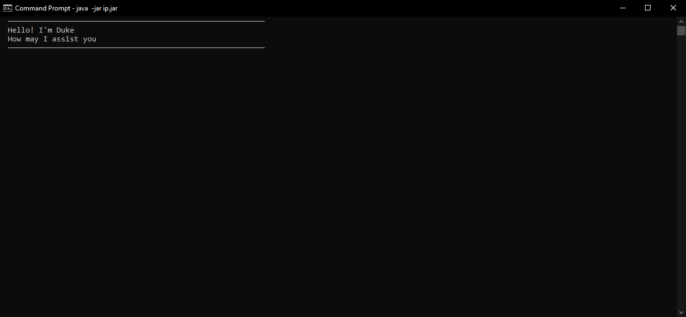

# User Guide

Duke is a Personal Assistant Command Line Chatbot designed to help you manage your tasks.

* [Quick Start Guide](#Quick-Start-Guide)
* [Features](#Features)
  * [View Help](#View-Help)
  * [Add a Todo Task](#Add-a-Todo-Task)
  * [Add a Deadline Task](#Add-a-Deadline-Task)
  * [Add an Event Task](#Add-an-Event-Task)
  * [List all Tasks](#List-all-Tasks)
  * [Mark Task as Done](#Mark-Task-as-Done)
  * [Delete a Task](#Delete-a-Task)
  * [Find Tasks](#Find-Tasks)
  * [Exit Program](#Exit-Program)
* [FAQ](#FAQ)
* [Command Summary](#Command-Summary)

## Quick Start Guide

1. Ensure you have `Java 11` installed on your computer.
2. Download the latest `ip.jar` file from [here](https://github.com/justinfidelis/ip/releases).
3. Move the file to the folder that you want to use as the Duke's root folder.
4. Execute the `java -jar ip.jar` command in the terminal in the same folder as the `ip.jar` file to launch Duke. The following output should be observed:



5. Type the command into the terminal and press Enter to execute it.
6. Refer to the [features](#Features) section below for details of each command

## Features

### View Help

Displays a list of all available commands.

Format: `help`

Example of usage:

```
help
```

Expected output:

```
  ──────────────────────────────────────────────────────────
  Here is a list of commands:
    todo [task name] - adds todo task to task manager
    event [task name] /at [date] - adds event task to task manager
    deadline [task name] /by [date + time] - adds deadline task to task manager
    list - lists all tasks
    done [task index] - marks the specified task as completed
    delete [task index] - deletes the specified task
    find [keyword] - lists all tasks whose name contains the keyword
    bye - close the application
  ──────────────────────────────────────────────────────────
```

### Add a Todo Task

Adds a Task that does not have any date/time information attached to it.

Format: `todo [TASK_NAME]`

Example of usage:

```
todo buy groceries
```

Expected output:

```
  ──────────────────────────────────────────────────────────
  Ok! I've added this task:
    [T][ ] buy groceries
  Now you have 1 task.
  ──────────────────────────────────────────────────────────
```

### Add a Deadline Task

Adds a Task that has date/time information attached to it.

Format: `deadline [TASK_NAME] /by [DATE_TIME]`

* The `/by` tag must be present and surrounded with a space character on each side.
* The `[DATE_TIME]` parameter must be in the format `dd mm yyyy HHMM`. Example: `02 10 2021 0950` 
will correspond to 0950HRS on 2 Oct 2021.

Example of usage:

```
deadline submit report /by 18 10 2021 2359
```

Expected output:

```
  ──────────────────────────────────────────────────────────
  Ok! I've added this task:
    [D][ ] submit report (by: 18-Oct-21 2359)
  Now you have 2 tasks.
  ──────────────────────────────────────────────────────────
```

### Add an Event Task

Adds a Task that has text information attached to it.

Format: `event [TASK_NAME] /at [EVENT_INFO]`

* The `/at` tag must be present and surrounded with a space character on each side.
* The `[EVENT_INFO]` parameter can contain any text information

Example of usage:

```
event project meeting /at Sept 29th 4-6pm
```

Expected output:

```
  ──────────────────────────────────────────────────────────
  Ok! I've added this task:
    [E][ ] project meeting (at: Sept 29th 4-6pm)
  Now you have 3 tasks.
  ──────────────────────────────────────────────────────────
```

### List all Tasks

Displays a list of all Tasks.

Format: `list`

Example of usage:

```
list
```

Expected output:
```
  ──────────────────────────────────────────────────────────
  Here are your tasks:
    1.[T][ ] buy groceries
    2.[D][ ] submit report (by: 18-Oct-21 2359)
    3.[E][ ] project meeting (at: Sept 29th 4-6pm)
  ──────────────────────────────────────────────────────────
```

### Mark Task as Done

Marks the task at the given index as done.

Format: `done [TASK_INDEX]`

* `[TASK_INDEX]` must correspond to the index of a task in the list.

Example of usage:

```
done 2
```

Expected output:
```
  ──────────────────────────────────────────────────────────
  Ok! I've marked this task as done:
    [D][X] submit report (by: 18-Oct-21 2359)
  ──────────────────────────────────────────────────────────
```

### Delete a Task

Deletes the task at the given index.

Format: `delete [TASK_INDEX]`

* `[TASK_INDEX]` must correspond to the index of a task in the list.

Example of usage:

```
delete 1
```

Expected output:
```
  ──────────────────────────────────────────────────────────
  Ok! I've deleted this task:
    [T][ ] buy groceries
  Now you have 2 tasks.
  ──────────────────────────────────────────────────────────
```

### Find Tasks

Displays a list of tasks that contain the given keyword.

Format: `find [KEYWORD]`

* `[KEYWORD]` can contain any letters, numbers and special characters (including spaces).

Example of usage:

```
find book
```

Expected output:
```
  ──────────────────────────────────────────────────────────
  Here are your tasks that contain the keyword "book":
    1.[T][X] buy books
    2.[T][ ] read book
    3.[D][ ] return book (by: 05-Oct-21 1700)
  ──────────────────────────────────────────────────────────
```

### Exit Program

Exits the program. 

Format: `bye`

Example of usage:

```
bye
```

Expected output:
```
  ──────────────────────────────────────────────────────────
  Goodbye! Hope to see you soon!
  ──────────────────────────────────────────────────────────
```

### FAQ

**Q:** How do I transfer my data to another computer?
**A:** Copy over `ip.jar` and `data` folder onto the other computer.

**Q:** Are the tasks and their information saved across application runs?
**A:** Yes, tasks and their information are saved upon edit and persists across runs.

### Command Summary

| Action           | Format                                 | Example                                |
| :---             | :---                                   | :---                                   |
| Help         | `help`                                 | `help`                                 |
| Add Todo     | `todo [TASK_NAME]`                     | `todo buy groceries`                   |
| Add Deadline | `deadline [TASK_NAME] /by [DATE_TIME]` | `return book /by 08 10 2021 1700`      |
| Add Event    | `event [TASK_NAME] /at [EVENT_INFO]`   | `event lunch /at Tim's house Tues 2pm` |
| List         | `list`                                 | `list`                                 |
| Done         | `done [TASK_INDEX]`                    | `done 2`                               |
| Delete       | `delete [TASK_INDEX]`                  | `delete 1`                             |
| Find         | `find [KEYWORD]`                       | `find buy`                             |
| Exit         | `bye`                                  | `bye`                                  |
