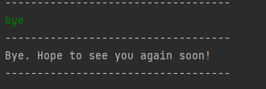

# Duke User Guide
Duke is a command line task tracking application that helps you keep track of your daily tasks.

## Getting Started
1. Download JRE11.
2. Download the latest release `Duke.jar` file.
3. In the directory containing the `Duke.jar` file, run `java -jar Duke.jar`.

## Features
* [Add a task](#Add-a-task)
* [Delete a task](#Delete-a-task)
* [Mark a task as done](#Mark-a-task-as-done)
* [Find a task](#Find-a-task)
* [List all tasks](#List-all-tasks)
* [Exit Duke](#Exit-Duke)

### Add a task
Duke supports 3 types of tasks:
1. ToDo: A task with a description.
2. Deadline: A task with a description and a deadline.
3. Event: A task with a description and a location.

To add any of the 3 tasks, run:
1. `todo <description>`
2. `deadline <description> /by <deadline>`
3. `event <description> /at <location>`

Example:

### Delete a task
To delete a task, enter its index in the format: `delete <taskIndex>`

Example:

### Mark a task as done
To mark a task as done, enter its index in the format: `done <taskIndex>`

Example:

### Find a task
To find tasks that has a certain word, enter the word in the format: `find <keyword>`

Example:

### List all tasks
To list all tasks that Duke knows, enter `list`.

Example:

### Exit Duke
To exit Duke, simply type `bye`.

Example:

## Data Persistence
Data will be stored in `./data/tasks.txt`.

When Duke starts up, tasks that are stored in `./data/tasks.txt` will be loaded.

Duke automatically saves tasks to `./data/tasks.txt` in real time so there is no need to manually save tasks.