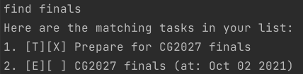

# User Guide
Duke is a cross-platform desktop task manager app that helps you keep track of your tasks through the command line interface. 
Fast and lightweight, it is best suited for fast typists.

- [Set Up](#setup)
- [Quick Start](#quick-start)
- [Features](#features)
  - [Getting help](#getting-help-help)
  - [Adding a Todo Task](#adding-a-todo-task-todo)
  - [Adding a Deadline Task](#adding-a-deadline-task-deadline)
  - [Adding an Event Task](#adding-an-event-task-event)
  - [Listing all Tasks](#listing-all-tasks-list)
  - [Marking Task as Done](#marking-task-as-done-done)
  - [Finding Tasks](#finding-tasks-find)
  - [Deleting Tasks](#deleting-tasks-delete)
  - [Exiting Duke](#exiting-duke-bye)
  - [Auto Save](#auto-save)
- [Command Summary](#command-summary)

## Setup
1. Ensure that you have [Java 11](https://docs.aws.amazon.com/corretto/latest/corretto-11-ug/downloads-list.html) installed in your desktop
2. Download the [latest version of Duke](https://github.com/flerovious/ip/releases/tag/A-Release)
3. You should have `ip.jar` downloaded. Now, copy the `ip.jar` to the folder you want to use for Duke
4. Open command prompt on Windows or terminal on Mac/Ubuntu
5. `cd` to the folder selected in step 3
6. Run Duke with `java -jar ip.jar` in your command prompt or terminal

## Quick Start
1. On startup, you should see the following \

2. Type commands and press Enter to execute them. Enter the `help` command if you ever get lost
3. Refer to [Features](#features) below for details of each command

## Features 
The following are the features of Duke

### Getting help `help`
Lists all possible commands and their syntax \
\
Example usage: 
```console
help
```
Expected outcome: \


### Adding a Todo Task `todo`
Adds a Todo task which includes the title of the todo \
\
Example of usage:
```console
todo Prepare for CG2027 finals
```
Expected outcome: \


### Adding a Deadline Task `deadline`
Adds a Deadline task which includes the title of the deadline and the due date in `yyyy-mm-dd` format \
\
Example of usage:
```console
deadline CS2113T weekly quiz /by 2021-10-01
```
Expected outcome: \


### Adding an Event Task `event`
Adds an Event task which includes the title of the event and the time of the event \
\
Example of usage:
```console
event CG2027 finals /at 2021-10-02
```
Expected outcome: \


### Listing all Tasks `list`
Shows a list of all tasks in the task list \
\
Example of usage:
```console
list
```
Expected outcome: \


### Marking Task as Done `done`
Marks the task at the given index as done \
\
Example of usage:
```console
done 1
```
Expected outcome: \


### Finding Tasks `find`
Finds all tasks in task list with titles that match the search keyword \
\
Example of usage:
```console
find finals
```
Expected outcome: \


### Deleting Tasks `delete`
Deletes the task at the given index \
\
Example of usage:
```console
delete 1
```
Expected outcome: \


### Exiting Duke `bye`
Exits the program \
\
Example of usage:
```console
bye
```
Expected outcome: \


### Auto Save
All changes to Tasks in the task list are automatically saved to `data/duke.txt` relative to `ip.jar` whenever the tasks list is modified

## Command Summary
| Action       | Format & Examples                                                                                            |
| :---         | :---                                                                                                         |
| **Help**     | `help`                                                                                                       |
| **Todo**     | `todo <TASK_TITLE>`<br>ex: `todo Prepare for CG2027 finals`                                                     |
| **Deadline** | `deadline <TASK_TITLE> /by <DATE in yyyy-mm-dd format>`<br>ex: `deadline CS2113T weekly quiz /by 2021-10-01` |
| **Event**    | `event <TASK_TITLE> /at <DATE in yyyy-mm-dd format>`<br>ex: `event CG2027 finals /at 2021-10-02`             |
| **List**     | `list`                                                                                                       |
| **Done**     | `done <TASK_NO>`<br>ex: `done 1`                                                                            |
| **Find**     | `find <KEYWORD>`<br>ex: `find finals`                                                                       |
| **Delete**   | `delete <TASK_NO>`<br>ex: `delete 1`                                                                        |
| **Exit**     | `bye`                                                                                                        |